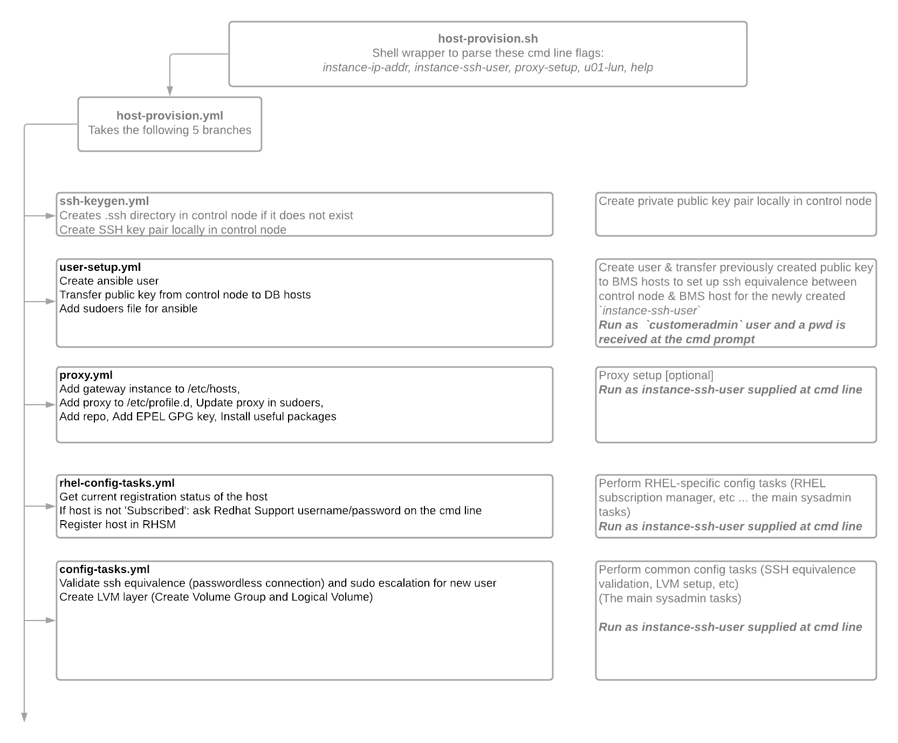

# Host provisioning

`host-provision.sh` takes a newly-delivered BMS host to a state where `install-oracle.sh` can be run, including user configuration, authentication, connectivity, and disk preparation.  

## Pre-requisities

* Follow BMS [planning](https://cloud.google.com/bare-metal/docs/bms-planning) and [implementation](https://cloud.google.com/bare-metal/docs/bms-setup) steps, including testing ssh connectivity as the `customeradmin` user.
* Obtain the `customeradmin` password, which will be prompted in the `host-provision.sh` run.
* If running Red Hat Enterprise Linux, obtain Red Hat credentials to request licenses.
* Choose or create a host to run `bms-toolkit` from;  this is typically the same [jump host](https://cloud.google.com/bare-metal/docs/bms-setup#bms-create-jump-host) as created as part of BMS implementation.  It will act as the ansible control node.
* On the control node, download and extract `bms-toolkit`;  in this example we take a zip file of the master branch:

```bash
curl -LO https://github.com/google/bms-toolkit/archive/refs/heads/master.zip
unzip master.zip
cd bms-toolkit-master
```

## Parmeters

* `--instance-ip-addr`: IP address of the BMS host to provision
* `--instance-ssh-user`: username on the BMS host to run `bms-toolkit` commands as.  The default is `ansible`.
* `--proxy-setup`: optionally configure a [proxy server](#proxy-server) on the control node to provide BMS host Internet access
* `--u01-lun`: optionally configure [Linux LVM](#linux-lvm) for the software mount in Oracle RAC installs

## Sample invocations

* To provision BMS host `172.16.30.1` to run as user `ansible9` and to configure a proxy server:
```bash
./host-provision.sh --instance-ip-addr 172.16.30.1  --instance-ssh-user ansible9 --proxy-setup true
```

* To provision BMS host `172.16.30.1` to run as user `ansible9` and to configure a proxy server, and also to configure Linux LVM on device `/dev/mapper/3600a098038314473792b51456555712f`:
```bash
./host-provision.sh --instance-ip-addr 172.16.30.1  --instance-ssh-user ansible9 --proxy-setup false --u01-lun /dev/mapper/3600a098038314344372b4f75392d3850
```

## Proxy server

If the BMS host requires outgoing Internet access (to access Red Hat license servers, for example), there are [several options](https://cloud.google.com/bare-metal/docs/bms-setup#bms-access-internet).  `host-provision.sh` can optionally configure Internet access through a proxy server on the control node.  A proxy server can improve network security by restricting which Internet sites can be accessed, as well as auditing such access.

## Linux LVM

BMS disk devices are presented as multipathed device nodes with the full world-wide name (WWN) of the device, such as `/dev/mapper/3600a098038314344372b4f75392d3850`.  This presents an issue when configuring the [data mount configuration file](https://github.com/google/bms-toolkit/blob/master/docs/user-guide.md#data-mount-configuration-file) when running `install-oracle.sh` for RAC clusters, as each nodes will have separate software mounts with their own WWNs.  The `--u01-lun` parameter addresses this issue by creating a Linux LVM volume with a consistent name `/dev/mapper/db-sw` that can be included in the data mount configuration file.

## Schematic

* With the caveat that code structure can quickly go out of date, the following represents the host-provision utility as it existed when this document was created.



The aim of publishing the above code flow is not accuracy or up-to-date codemap,
but rather function as a helpful start so the user can gain the basic understanding of the layout.
